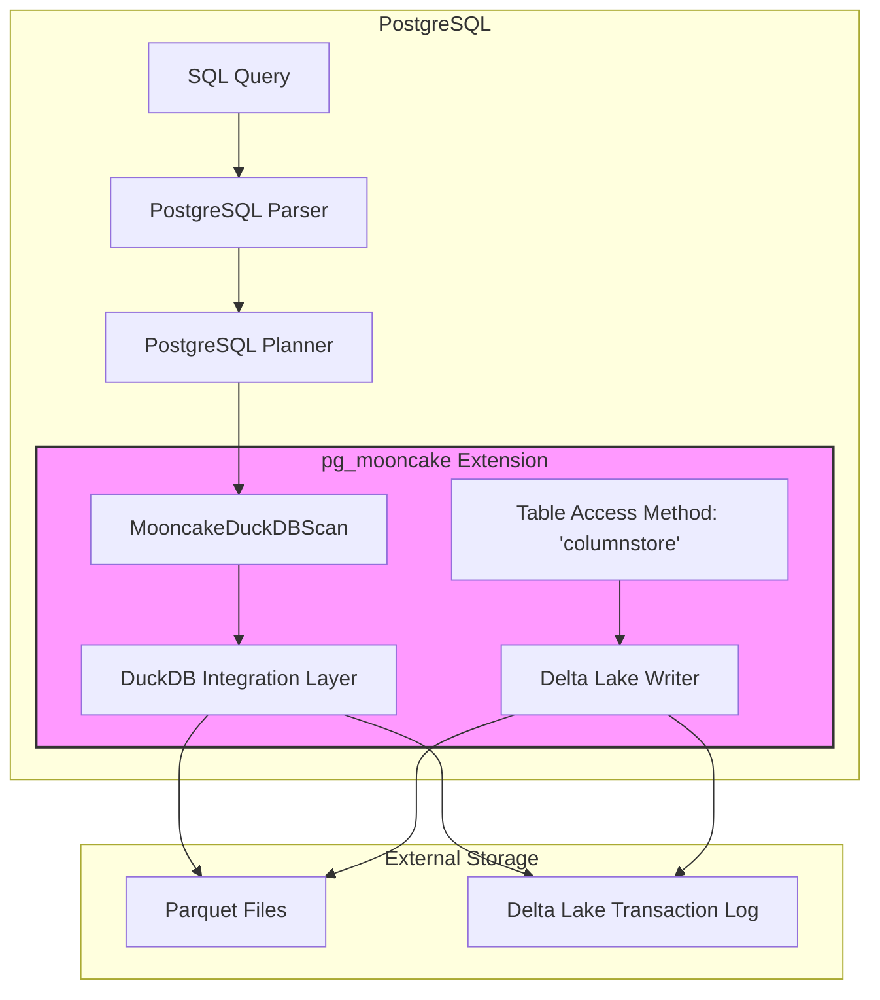
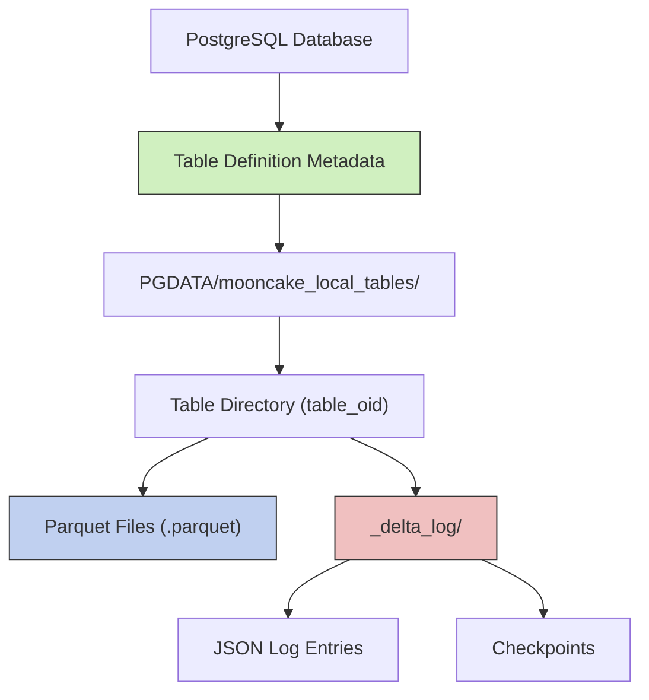
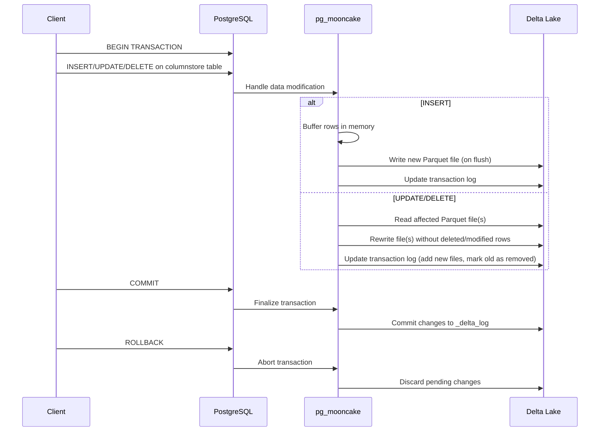
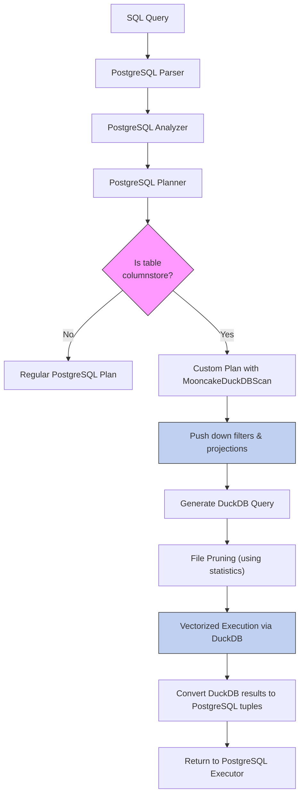
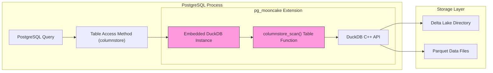
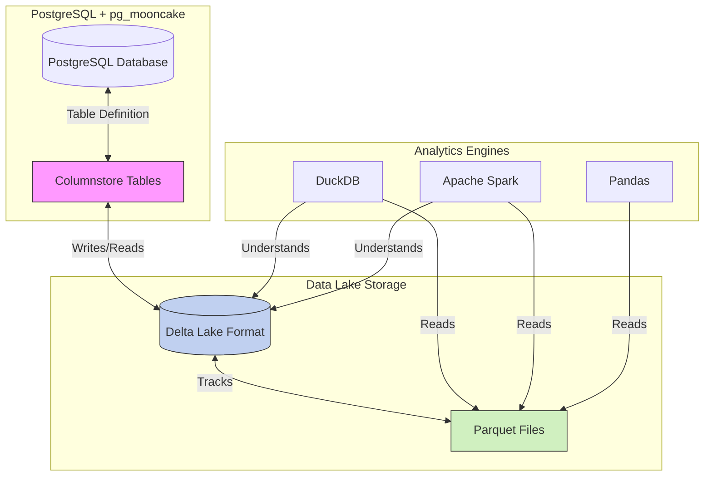
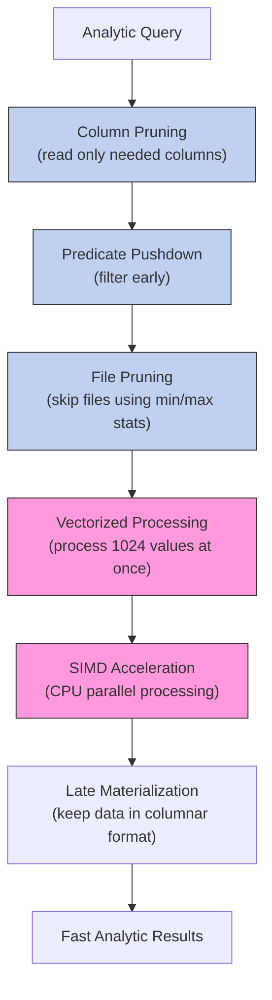

# pg_mooncake: Columnar Storage for PostgreSQL

## Architecture Overview



## Storage Engine: Columnar Format & Open Table Metadata

The pg_mooncake extension implements a new **table access method** called **`columnstore`**, allowing you to create tables with `USING columnstore` in PostgreSQL. Instead of storing data in PostgreSQL's heap pages, pg_mooncake writes table data as **columnar Parquet files** on disk (or object storage), with table metadata in **open formats** like **Delta Lake** (with planned support for **Apache Iceberg**) to track schema and transactions.



Each columnstore table corresponds to a directory (e.g., under `PGDATA/mooncake_local_tables`) containing Parquet data files and a **_delta_log** for transactions. Only lightweight metadata (table definitions) lives in PostgreSQL itself – the heavy analytic data is external, which allows other engines to read it too (for example, pointing DuckDB or Spark at the same Delta/Iceberg directory).

### Transaction Handling



Under the hood, **inserts** into a columnstore table are **appended** as new Parquet files, and **updates/deletes** are handled in "delete/insert" fashion – the affected Parquet file(s) are rewritten without the deleted or modified rows, and the Delta Lake transaction log is updated to mark old files as removed. These operations occur transactionally – pg_mooncake integrates with PostgreSQL transactions so that writes are only committed to the Delta log on a successful commit (and aborted on rollback).

## Query Processing & Optimization

pg_mooncake **plugs into the PostgreSQL planner/executor** so that queries on columnstore tables are transparently handled by DuckDB's engine. It defines a custom scan plan node (a CustomScan) for columnstore tables, which appears in EXPLAIN as **"Custom Scan (MooncakeDuckDBScan)"**.



During planning, the extension detects when a table is columnstore and replaces the normal SeqScan with this custom node. The custom plan node's logic uses DuckDB to execute the scan in a **vectorized** manner. Essentially, pg_mooncake takes the **filter conditions and projections** from the PostgreSQL query and **pushes them down** into an **embedded DuckDB query plan**. In other words, pg_mooncake turns the scan of a Parquet-backed table into a DuckDB operation that reads only the needed columns and applies WHERE clauses using DuckDB's efficient vectorized scan.

### Predicate Pushdown and File Skipping

```mermaid
flowchart TD
    Query["SELECT * FROM sales WHERE date > '2023-01-01' AND region = 'WEST'"] --> PGMooncake[pg_mooncake]
    
    PGMooncake --> Statistics["Check file statistics (min/max values)"]
    Statistics --> FileSkip["Skip files that can't match predicate"]
    
    subgraph "Files in storage"
        File1["File1.parquet\ndate: 2022-01 to 2022-06\nregion: EAST, WEST"]
        File2["File2.parquet\ndate: 2023-01 to 2023-06\nregion: EAST, SOUTH"]
        File3["File3.parquet\ndate: 2023-01 to 2023-06\nregion: WEST, NORTH"]
    end
    
    FileSkip -->|Skip (date range doesn't match)| File1
    FileSkip -->|Skip (region doesn't match)| File2
    FileSkip -->|Process (matches all predicates)| File3
    
    File3 --> DuckDBScan["DuckDB vectorized scan\nwith pushed-down predicates"]
    DuckDBScan --> Results[Return matching rows]
```

pg_mooncake's columnar format brings typical warehouse optimizations. Data is stored compressed in Parquet, and pg_mooncake keeps **column statistics** (like min/max values per file) to speed up reads. This allows **predicate pushdown** and **file skipping**: if a query's filter can be checked against a file's min/max and found to exclude that file, pg_mooncake can skip opening it.

## Integration with DuckDB



pg_mooncake achieves its magic by **embedding DuckDB** inside the PostgreSQL process. The project includes DuckDB as a library (via the `pg_duckdb` submodule) so that an instance of DuckDB can be invoked at runtime. When you install pg_mooncake, it builds a `libduckdb` and ships it along with the extension, effectively bundling DuckDB's engine into PostgreSQL.

At a code level, pg_mooncake registers a **DuckDB table function** called `columnstore_scan` which DuckDB uses to access PostgreSQL columnstore tables. This table function tells DuckDB how to find and read the Parquet files for a given table OID, and it integrates with DuckDB's optimizer by providing statistics like row count.

## Data Flow Across Multiple Systems



Because the on-disk format is open, a pg_mooncake table is essentially a Delta Lake table on disk – you can find its files via `SELECT * FROM mooncake.columnstore_tables` and directly query them with Pandas, DuckDB, or Spark outside PostgreSQL.

## Performance Optimization Flow



By relying on DuckDB's robust engine, pg_mooncake implements complex features with relatively little new code. The source code for pg_mooncake primarily wires together PostgreSQL hooks (like the Table AM handler and a planner hook) with DuckDB's C++ API. The heavy scanning logic is deferred to DuckDB, which reads Parquet and even supports reading remote files (S3) via DuckDB's built-in S3 support or via the Rust Delta Lake integration.

## Summary

pg_mooncake offloads columnstore query execution to an embedded DuckDB engine using the pg_duckdb project. The extension defines custom DuckDB table/functions (e.g., `columnstore_scan`) and hooks into PostgreSQL's query plan to invoke them. This clever architecture lets PostgreSQL act as an orchestrator, while DuckDB's vectorized execution and file format support do the hard work – enabling **fast analytics in PostgreSQL with minimal fuss**.

## Implementation Details

### Storage Engine
- Implements a custom Table Access Method (`columnstore`)
- Writes data as columnar Parquet files
- Uses Delta Lake for metadata and transaction tracking
- Handles updates/deletes by rewriting affected files
- Provides ACID guarantees via Delta Lake transaction log

### Query Execution
- Custom scan node (`MooncakeDuckDBScan`) replaces standard scan
- Pushes filters and projections to DuckDB
- Uses file-level statistics to skip irrelevant files
- Processes data in vectorized batches (not row-by-row)
- Converts DuckDB result vectors to PostgreSQL tuples

### DuckDB Integration
- Embeds DuckDB as a library within PostgreSQL
- Registers a custom `columnstore_scan` function in DuckDB
- Provides file statistics to DuckDB's optimizer
- Uses DuckDB's efficient Parquet reader
- Leverages DuckDB's vectorized execution engine

### Performance Features
- Column pruning (read only required columns)
- Predicate pushdown (filter early in the process)
- File skipping (avoid reading irrelevant files)
- Compression at rest (Parquet's built-in compression)
- Vectorized processing (process batches of values)
- SIMD acceleration (use CPU parallel instructions)
- Late materialization (keep data in columnar format longer)