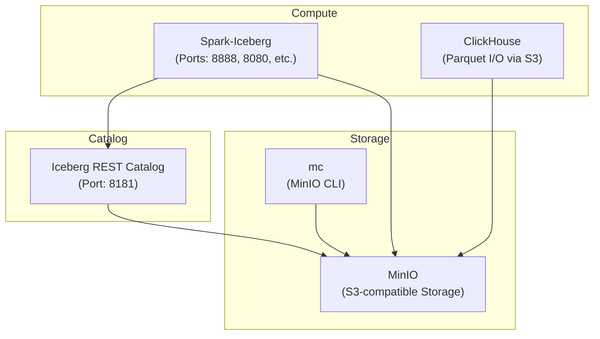
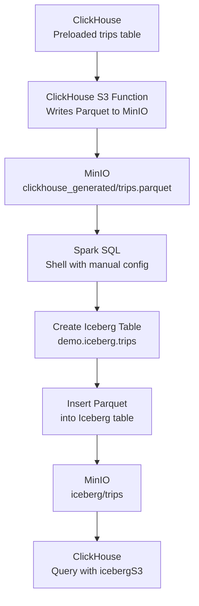

### Queries
Source: https://www.e6data.com/blog/iceberg-metadata-evolution-after-compaction

Note: This requires a bit more memory so it is advised to increase your colima/docker desktop memory limits.
```shell
colima start --cpu 4 --memory 8
```

### Docker Setup



#### Setup
Note: You can view the s3 directories and folders using minio ui
```shell
http://localhost:9001/login
username: admin
password: passwrod
```
All the commands from here on should be run from within the directory. If you are in a different directory, cd into the directory **end to end**.

```shell
# Run only if not the end to end directory
cd end to end
```

Once in the directory, grant executable permissions to setup.sh and teardown.sh

```shell
chmod +x ./setup.sh ./teardown.sh
```

### Setup Script Summary (`setup.sh`)

This script automates the setup of a local lakehouse environment with Spark, Iceberg, MinIO, ClickHouse, and a REST catalog.

**Key actions:**

- Creates required directories (`lakehouse`, `minio/data`, `notebooks`, etc.)
- Downloads NYC Taxi dataset (`trips_0`, `trips_1`, `trips_2`) and extracts it into ClickHouse's import directory
- Downloads necessary JARs for Spark to connect with S3 (Hadoop AWS and AWS SDK)
- Starts all services using Docker Compose
- Initializes the ClickHouse table and loads the dataset using `init-clickhouse.sh`

### ClickHouse Initialization Script Summary (`init-clickhouse.sh`)

This script is executed inside the ClickHouse container to:

- Wait for the ClickHouse server to be ready
- Create a `trips` table (NYC Taxi schema) with geolocation, fare, and trip info
- Import all `.tsv` dataset files from `/var/lib/clickhouse/data_import` into the `trips` table

The table uses the `MergeTree` engine with `pickup_datetime` and `dropoff_datetime` as the primary key.

### Teardown Script Summary (`teardown.sh`)

Use this script to clean up the entire lakehouse environment:

- Stops and removes all Docker containers and volumes
- Deletes local project directories:
  - `lakehouse/` (Iceberg data)
  - `minio/` (object store data)
  - `clickhouse/` (database files and import data)

## Flow 1: Moving Data from Clickhouse to Iceberg Tables



### Step 1: Data from clickhouse tables into S3 as a parquet file

Fire up clickhouse client

```shell
docker exec -it clickhouse clickhouse-client
```
The pre created **trips** table is within default database. We will write this table as a parquet file into s3 bucket.

```sql
INSERT INTO FUNCTION s3(
  'http://minio:9000/lakehouse/clickhouse_generated/trips.parquet',
  'admin', 'password',
  'Parquet'
)
SELECT * FROM trips;
```

This parquet file can be then queried using clickhouse itself.

Count of rows from parquet file
```sql
SELECT count(*) FROM s3('http://minio:9000/lakehouse/clickhouse_generated/trips.parquet','admin','password');
```
It should match the count of rows in trips table
```sql
SELECT count(*) from trips;
```

### Step 2: Creating iceberg table using this parquet file
Fire up spark sql: For some reason spark sql does not inherit the configurations passed 
as the env variables in docker compose file. Hence we are configuring the same here.

```shell
docker exec -it spark-iceberg spark-sql \
  --conf spark.driver.extraClassPath="/opt/spark-extra-jars/*" \
  --conf spark.executor.extraClassPath="/opt/spark-extra-jars/*" \
  --conf spark.hadoop.fs.s3a.access.key=admin \
  --conf spark.hadoop.fs.s3a.secret.key=password \
  --conf spark.hadoop.fs.s3a.endpoint=http://minio:9000 \
  --conf spark.hadoop.fs.s3a.path.style.access=true
```
Create table
```sql
CREATE TABLE demo.iceberg.trips (
                                       trip_id             INT,
                                       pickup_datetime     TIMESTAMP,
                                       dropoff_datetime    TIMESTAMP,
                                       pickup_longitude    DOUBLE,
                                       pickup_latitude     DOUBLE,
                                       dropoff_longitude   DOUBLE,
                                       dropoff_latitude    DOUBLE,
                                       passenger_count     INT,
                                       trip_distance       FLOAT,
                                       fare_amount         FLOAT,
                                       extra               FLOAT,
                                       tip_amount          FLOAT,
                                       tolls_amount        FLOAT,
                                       total_amount        FLOAT,
                                       payment_type        STRING,
                                       pickup_ntaname      STRING,
                                       dropoff_ntaname     STRING
) USING ICEBERG
PARTITIONED BY (
    payment_type
);
```

Insert into this iceberg table using parquet file ingested before
```sql
INSERT INTO demo.iceberg.trips
SELECT * FROM parquet.`s3a://lakehouse/clickhouse_generated/trips.parquet`;
```
You can query the count of rows using this spark sql query:
```sql
SELECT COUNT(*) FROM demo.iceberg.trips;
```

### Step 3: Querying iceberg tables from clickhouse

Fire up clickhouse client

```shell
docker exec -it clickhouse clickhouse-client
```

Query this new table count
```sql
SELECT count(*) FROM icebergS3('http://minio:9000/lakehouse/iceberg/trips','admin','password');
```
It should match the count of rows in trips table
```sql
SELECT count(*) from trips;
```