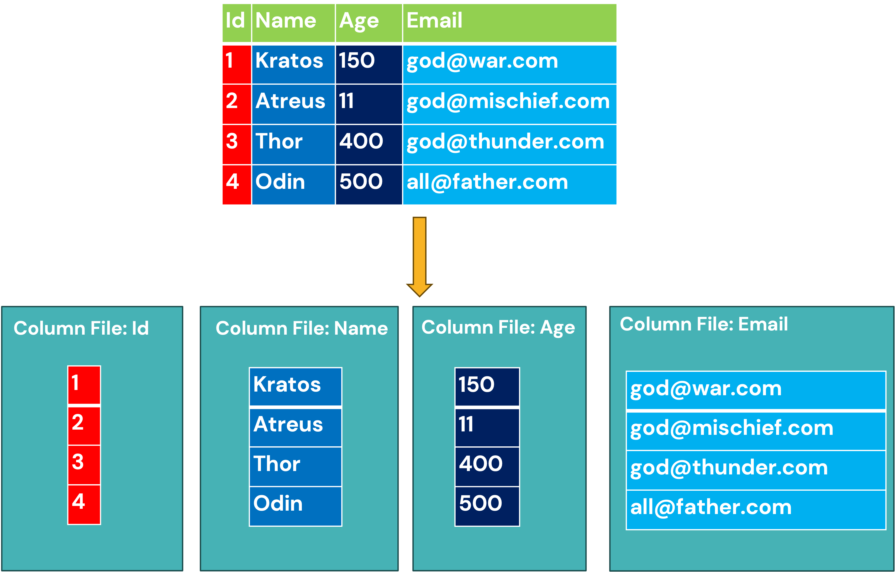

# Columnar Storage: The Analytics Ninja (Who Loves Compression)

## 1. Introduction: What’s Columnar Storage? 

Imagine you’re a librarian. Instead of stacking books *row-by-row* on shelves (like row storage), you rip out **all the Chapter 3s** and store them together. That’s columnar storage! Each "column" holds *all values for a single attribute* (like `email`), stored contiguously on disk.

In technical terms: 
**Columnar storage** organizes data by *columns*. When you save data, all values for a column are written sequentially, like obsessive fans grouping all Thor memes into one folder. This makes it perfect for analytical workloads where you scan **specific columns** across millions of rows—like calculating average email length or finding how many gods use `@war.com`.

---

## 2. Nature of Workloads: OLAP, the "Overworked Data Scientist"

Columnar storage is the superhero for **OLAP (Online Analytical Processing)**. Think of OLAP as a data scientist:
- **Aggregate-heavy**: What’s the average lifespan of Norse gods?
- **Scan millions of rows**: Find all emails containing ‘god’ in 10TB of data.
- **Few columns accessed**: I need `email` and `id`—ignore `name`, `weapon`, and `daddy_issues`.

It’s terrible for OLTP, though. Updating a single row in columnar storage is like editing one word in every book in a library. Use row storage for that chaos.

---

## 3. Requirements for Being Good at OLAP (aka "Compress or Die")

To handle OLAP, a storage format must:
- **Read columns quickly**: "Give me *only* the `email` column, not Odin’s entire biography."
- **Compress like a maniac**: Turn 1TB of data into 100GB using dark magic (math).
- **Parallelize scans**: Let 1000 workers scan different chunks of a column at once.
- **Skip irrelevant data**: "Ignore all rows with `age < 200` (Thanks, metadata!)

---

## 4. How Data is Laid Out on Disk: The Columnar Temple

Let’s reuse our mythical `users` table for representation.



### Key Observations:
1. **Column isolation**: Each column lives in its own neighborhood. Want emails? The disk head *only* reads the email file. No wasted I/O!
2. **Type homogeneity**: All values in a column are the same data type. This makes compression **crazy efficient** (more on that below).
3. **Metadata magic**: Stores min/max values, so queries like `id > 10` can skip entire chunks of data.

---

## 5. Compression: The Secret Sauce

Columnar storage **dominates** compression because:
- **Repeated values**: Columns often have duplicates (e.g., if a table has countries of all alive humans, there will be only 195 unique values, but repeated over 8 billion times).
- **Same data type**: Easier to apply algorithms like:
    - **Run-Length Encoding**: Store `India x 1000` as "India, count=1000".
    - **Dictionary Encoding**: Map strings to integers. E.g., `India` → `1`
- **Delta Encoding**: Store differences between numbers (useful for timestamps/IDs).

## 6. What Happens When You Run `SELECT count(Name) WHERE age > 200 GROUP BY Name;`

Let’s break this down like Loki dissecting Midgardian bureaucracy:

1. **Query Parsing**:  
   *"I need to count how many people named and grouped and are over 200. Time to flex columnar superpowers."*

2. **Metadata Check**:
    - Fetch min/max values of the `age` column. Skip entire chunks where max `age` < 200.  
      *(Goodbye, chunks full of immortal babies!)*

3. **Column Scan**:
    - Read **only** the `age` and `Name` columns (ignore `email`, `id`, and Thor’s therapy bills).
    - Decompress the `age` column:
        - Filter out rows where `age ≤ 200` (farewell, Kratos’ midlife crisis).
    - Decompress the `Name` column:
        - Use **dictionary encoding** to map names like `Odin` → `1`, `Thor` → `2` (saves space, speeds up grouping).

4. **Aggregation & Grouping**:
    - For survivors of the `age > 200` filter:
        - **Hash table magic**: Group identical `Name` values (all "Odin"s clump together).
        - **Count ‘em up**: Track how many times each `Name` appears.
    - *Bonus speed*: Compressed `Name` values (integers) make hashing/grouping is faster than raw strings.

5. **Return Result**:  
   | Name  | count  |  
   |-------|--------|  
   | Odin  | 200    |  
   | Thor  | 1000   |
---

### **Why It’s Faster Than Row Storage**:
- **I/O Savings**: Only read 2/4 columns (`Name` + `age`), not entire rows.
- **Compression Wins**:
    - `Name` column compressed via dictionary encoding → lesser disk i/o.
    - `age` column compressed as integers.
- **Batch Processing**: Decompress/process chunks of 10,000 rows at once (like feeding Asgardian data to a ravenous pack of wolves).
- **Metadata Skip**: Ignored chunks with `age ≤ 200` entirely. No wasted reads!

Columnar storage: Making analytics feel like cheating since 2003.

---

## 7. Databases That Love Columnar Storage

- **Snowflake**: "I store data in columns and charge you $$$ for compute."
- **PostgreSQL (with extensions)**:
  ```sql
  -- Using Citus for columnar storage
  CREATE TABLE users_columnar (...) USING columnar;
- **Clickhouse**: "I am an open source olap db optimised for everything olap." 

### 8. Conclusion: Columnar Storage, the Data Analyst’s Best Friend

**Use columnar storage when**:
- You’re doing OLAP (analytics, aggregations, scans).
- Your queries touch <20% of columns.
- You want to compress data into oblivion️.

**Avoid it when**:
- You’re doing OLTP (single-row writes/updates).
- Your queries fetch entire rows. (Row storage will mock you)

So there you have it! Columnar storage: the compression-obsessed, analytics-wielding hero who laughs at TB-sized datasets. Now go analyze responsibly.