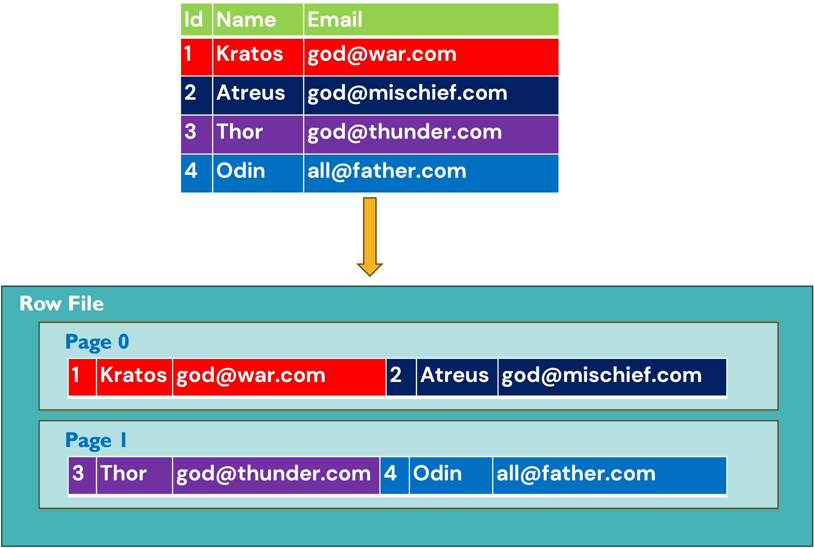

# Row-Oriented Storage: The OG Data Layout

### 1. Introduction: What Even *Is* Row-Oriented Storage?

Imagine you’re at a buffet. You grab a plate (a **row**) and pile on mashed potatoes, steak, green beans, and a suspiciously shiny Jell-O cup. 
That’s row-oriented storage! Each "plate" (row) holds **all the data for a single record**, stored contiguously on disk.

In technical terms: **Row-oriented storage** organizes data by *rows*. 
When you save a row, all its columns (id, name, email, etc.) are written sequentially, like a clingy group of friends who refuse to split up. 
This makes it great for transactional workloads where you frequently access **entire rows**—like fetching a user’s profile or updating an order.

---

### 2. Nature of Workloads: OLTP, the "Always Busy Coffee Shop"

Row-oriented storage is the MVP for **OLTP (Online Transactional Processing)** workloads. Think of OLTP as a busy coffee shop:
- **Fast, frequent transactions**: I need a latte, stat!
- **Short-lived operations**: Update table X, insert into table Y, charge my credit card—thanks, bye!
- **Point queries**: Give me the latte order for Customer `#10`. **NOW**.

It’s terrible for **OLAP (Online Analytical Processing)**, though. Asking it to analyze billions of rows is like forcing a barista to calculate the average caffeine consumption of everyone in New York. They’ll cry. Use columnar storage for that.

---

### 3. Requirements for Being Good at OLTP (aka "Don’t Be Slow")

To handle OLTP, a storage format must:
- **Write fast**: Like scribbling a sticky note, not painting a mural.
- **Read entire rows quickly**: "Give me ALL the data for User 10, not just their toenail color."
- **Support ACID transactions**: No half-baked operations. It’s all or nothing, like proposing marriage.
- **Handle concurrency**: Let 1000 baristas (threads) take orders without spilling coffee on each other.

---

### 4. How Data is Laid Out on Disk: The Sacred Ritual

This is where row oriented storage **shines**. Here's how your mythical `users` table would look on disk in a row-oriented format. Each row is stored as **one continuous byte stream**, with columns glued together like Thor's hammer to his hand:

#### Key Observations:
1. **No column separation**: Columns are packed like Viking loot in a longship. The database uses metadata (not shown here) to know where one column ends and another begins.
2. **Row-centric**: To read Kratos's email, you **must read his entire row** (including his `id` and `name`). Resistance is futile.
3. **Sequential neighbor access**: Kratos data sits right before Atreyus's, like an awkward family reunion. Need Kratos? The disk head reads the **entire page** and gets Atreus data too!.

#### Why This Matters for `SELECT * WHERE id=1`:
- The disk head zooms to Kratos’s row, slurps up **2 Rows in one read**, and ignores Thor/Odin. Efficient for OLTP!
- But ask for *all emails* and… well, good luck reading every byte of every row. Columnar storage laughs in Valhalla.

### 5.Conclusion: Row Storage is the Reliable, Boring Friend You Need

Use row-oriented storage when:
- You’re doing OLTP (transactions, single-row CRUD).
- You need ACID compliance.
- Your queries fetch entire rows frequently.

Avoid it when:
- You’re analyzing data (OLAP). Columnar storage will mock you otherwise.
- You enjoy slow queries. (Wait, no one does that.)

So there you have it! Row storage: the unglamorous workhorse that keeps your latte orders flowing. Now go forth and index responsibly. 